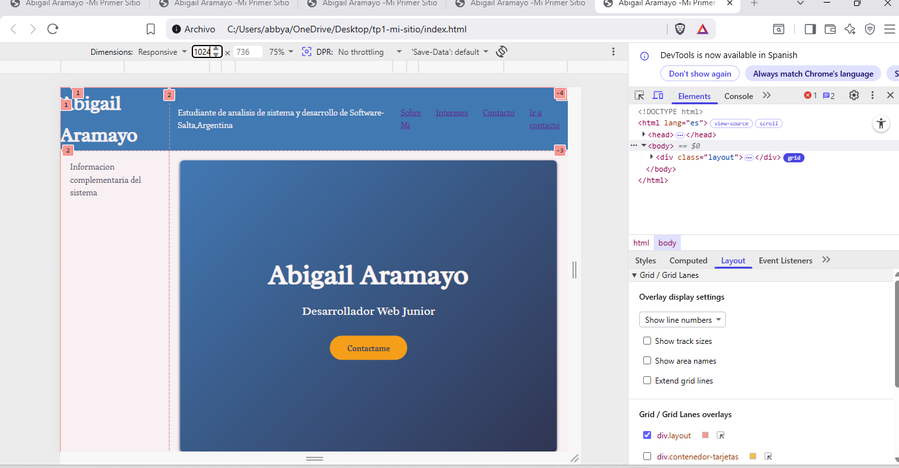
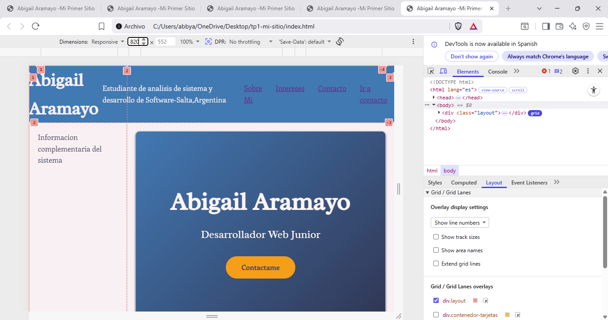
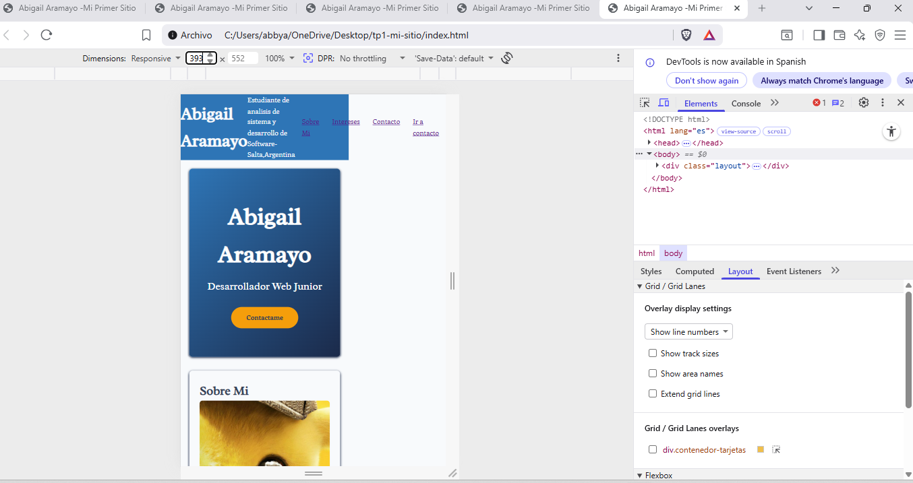

# TP1: Mi Primer Sitio Web

**Nombre:** Abigail Aramayo  
**Número de TP:** 1  
**Fecha:** 23 de marzo de 2026
#  link del sitio.
Mi portafolio:
https://abigail-aramayo.github.io/tp1-mi-sitio/

#  Descripción
Primer proyecto web con estructura semántica.

## Tecnologías usadas
* HTML5 
* CSS3
* Reponsive Design
# Reflexión sobre la terminal
Aprender a usar la terminal es importante porque nos permite realizar tareas o trabajos complejos
utilizando los  comandos por lo que nos hace hace ahorrar tiempo ,ademas de que los comandos basicos no cambian 
por lo que se puede trabajar con los mismos comandos en distintos sistemas operativos.Ademas  tenemos otros beneficios
a comparacion de la interfaz grafica como la de ejecutar procesos en segundo plano y automatizar tareas que se repiten .

# Ruta de instalación de Git
Mi ruta de instalación es: `C:\Program Files\Git\cmd\git.exe`
# Capturas del diseño Reponsivo
*Desktop

*Tablet

*Mobil

